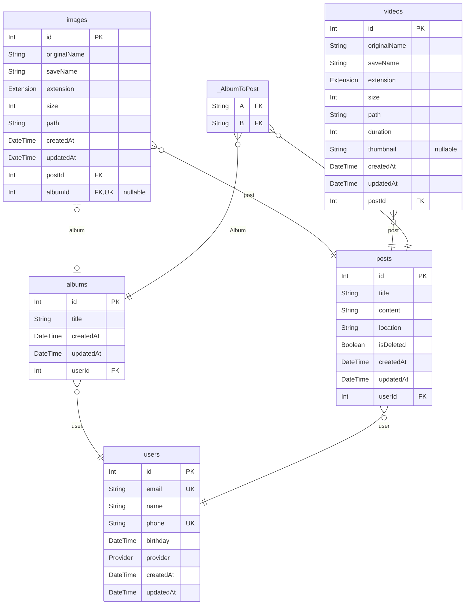

# Memory album

> Generated by [`prisma-markdown`](https://github.com/samchon/prisma-markdown)

- [default](#default)

## default

### `albums`

Properties as follows:

- `id`:
- `title`:
- `createdAt`:
- `updatedAt`:
- `userId`:

### `images`

Properties as follows:

- `id`:
- `originalName`:
- `saveName`:
- `extension`:
- `size`:
- `path`:
- `createdAt`:
- `updatedAt`:
- `postId`:
- `albumId`:

### `posts`

Properties as follows:

- `id`:
- `title`:
- `content`:
- `location`:
- `isDeleted`:
- `createdAt`:
- `updatedAt`:
- `userId`:

### `users`

Properties as follows:

- `id`:
- `email`:
- `name`:
- `phone`:
- `birthday`:
- `provider`:
- `createdAt`:
- `updatedAt`:

### `videos`

Properties as follows:

- `id`:
- `originalName`:
- `saveName`:
- `extension`:
- `size`:
- `path`:
- `duration`:
- `thumbnail`:
- `createdAt`:
- `updatedAt`:
- `postId`:

### `_AlbumToPost`

Pair relationship table between [albums](#albums) and [posts](#posts)

Properties as follows:

- `A`:
- `B`:
